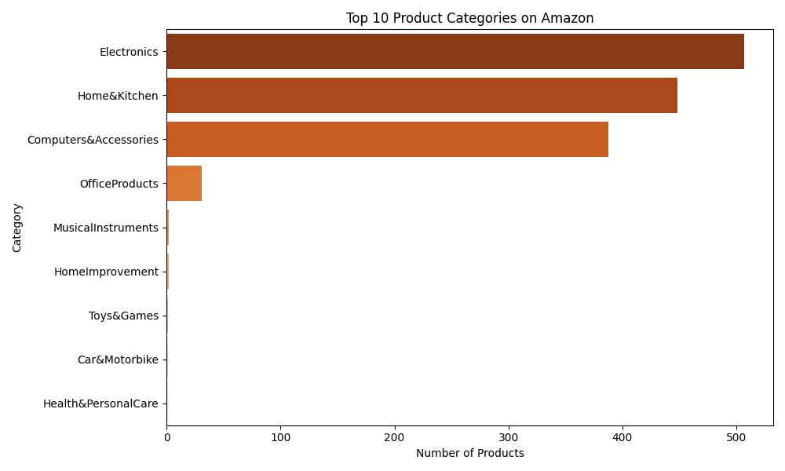
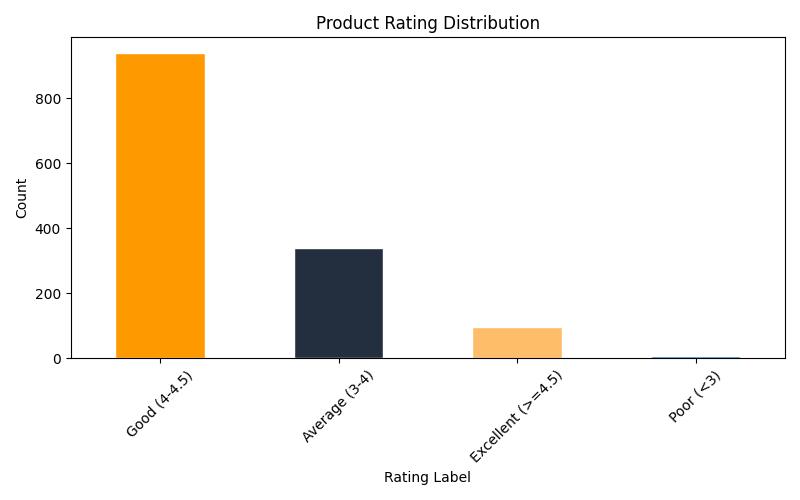
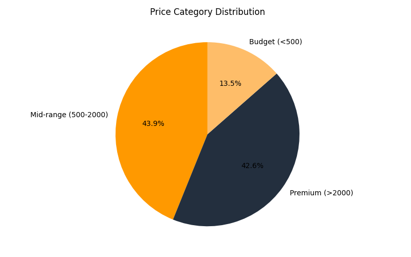

# 🛒 Amazon Sales & Product Performance Analysis 

## 🌟 Project Overview
This project is an end-to-end data analytics solution that explores over 1,300 Amazon product listings. It demonstrates a complete data lifecycle: from raw data cleaning and database management to advanced analytical querying and professional dashboarding.

## 🛠️ The Data Stack
- **Data Cleaning (Python/Pandas):** Handled missing values, standardized currency, and engineered new features like 'Value Score'.
- **Database Analysis (SQL):** Developed complex queries to segment products by price and category performance.
- **Reporting (Excel):** Utilized Pivot Tables for rapid data summarization and validation.
- **Visualization (Power BI):** Created an interactive dashboard to track business KPIs.

## 📁 Repository Contents
- **`Amazon_Clean_Final.csv`**: The fully processed dataset.
- **`sql queries.sql`**: Professional SQL scripts used for data aggregation.
- **`amazon dashboard.pbix`**: The master Power BI file.
- **`Visuals/`**: Exports of the data trends (Price Category, Top Categories, etc.).

## 📊 Key Insights
- **Category Leadership:** Computers & Accessories and Electronics represent the highest volume of high-rated products.
- **The Value Sweet-Spot:** Products categorized as 'Mid-range' (500-2000 Rs) consistently show higher customer satisfaction scores compared to 'Premium' items.
- **Discount Impact:** There is a direct correlation between high discounts (>50%) and increased 'Rating Counts', suggesting price cuts significantly drive sales volume.

## 🖼️ Dashboard Gallery
| Top Categories | Rating Distribution | Price Analysis |
| :---: | :---: | :---: |
|  |  |  |

---
Analyzed and Developed by Shivani Sharma
